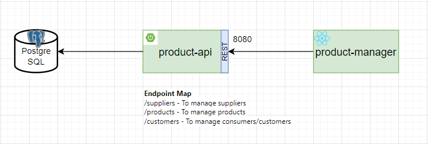

# API Manager

API for managing products and sales for commercial solutions.

## Index

- [Overview](#overview)
- [Technologies Used](#technologies-used)
- [Documentation](#documentation)
- [How to Use](#how-to-use)
- [Contribution](#contribution)
- [License](#license)

## Overview

This project integrates the backend that manages the frontend solution for sales and suppliers.

## Technologies Used

- [Java](https://www.java.com/pt-BR/)
- [Spring Boot](https://spring.io/projects/spring-boot)
- [Hibernate](https://hibernate.org/)
- [PostgreSQL](https://www.postgresql.org/)

## Documentation

### Swagger
- [Swagger](http://localhost:8080/swagger-ui/index.html#/)

### Diagram

### Route Mapping

#### Suppliers

Application package containing the supplier management solution.

| Método HTTP | Endpoint     | Descrição                                                                      |
|-------------|--------------|--------------------------------------------------------------------------------|
| POST        | `/suppliers` | Endpoint para criar o registro de um fornecedor na aplicação.                  |
| GET         | `/suppliers` | Endpoint para listar todos os fornecedores da aplicação.                       |
| GET         | `/suppliers/{id}` | Endpoint para obter dados de um fornecedor especifico da aplicação.            |
| DELETE      | `/suppliers/{id}` | Endpoint para deletar o registro de um fornecedor da aplicação..               |
| PUT         | `/suppliers/{id}` | Endpoint para atualizar todo o registro de um fornecedor da aplicação. |

#### Products

Application package containing the product management solution.

| Método HTTP | Endpoint     | Descrição                                               |
|-------------|--------------|---------------------------------------------------------|
| POST        | `/products`  | Endpoint para criar o registro de produto na aplicação. |

#### Costumers

Application package containing the consumer/customer management solution.

| Método HTTP | Endpoint     | Descrição                                               |
|-------------|--------------|---------------------------------------------------------|
| POST        | `/costumers` | Endpoint para criar o registro de cliente na aplicação. |

## How to Use

To run this service, you need to either start it with Docker or deploy it to an Elastic Beanstalk instance.

### Prerequisites

Example:
- JDK 11 or higher installed
- PostgreSQL installed and configured
- Maven installed

### Configuration

Explain how to configure the development environment, including database configuration, environment variable setup, etc.

1. Clone the repository:: `git clone https://github.com/seu-usuario/seu-projeto.git`
2. Import the project into your preferred IDE.
3. Configure the database properties in the file `application.properties`.

### Run Service

#### Run in IDE
1. Navigate to the root directory of the project.
2. Run the command: `mvn spring-boot:run`.

#### Run with Docker
1. Navigate to the root directory of the project.
2. Execute with Docker: `docker-compose up`

## Contribution

- Open a PR (Pull Request) with improvements
- Report bugs or request new features through issues

## License

his project is licensed under the [MIT License](LICENSE).
